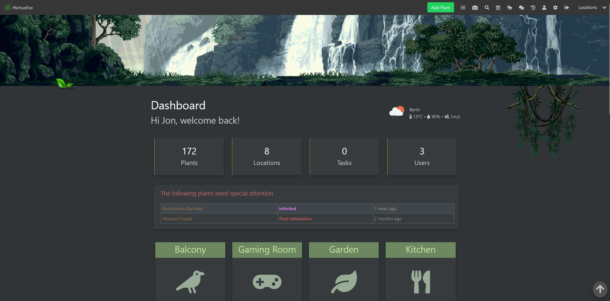

<h1 align="center">
    <br/>
    HortusFox
</h1>

<p align="center">
    A self-hosted collaborative plant management system<br/>
    (C) 2023 - 2024 by Daniel Brendel
</p>

<p align="center">
    <a href="https://www.hortusfox.com/">www.hortusfox.com</a>
</p>

<p align="center">
    
    
    
    
</p>

<p align="center">
    <a href="https://discord.gg/kc6xGmjzVS"></a>
    <a href="https://www.reddit.com/r/hortusfox/"></a>
    <a href="https://www.youtube.com/@HortusFox"></a>
    <a href="https://www.instagram.com/hortusfox/"></a>
</p>

<p align="center">
    <a href='https://ko-fi.com/C0C7V2ESD' target='_blank'></a>
</p>

<p align="center">
    <br/>
</p>

## Table of Contents

- [Description](#description)
- [Features](#features)
- [Resources](#resources)
- [Installation](#installation)
  - [Docker](#docker)
  - [Installer](#installer)
  - [Manual](#manual)
- [Cronjobs](#cronjobs)
- [System requirements](#system-requirements)
- [Contributing](#contributing)
- [Security](#security)

## Description

HortusFox is a self-hosted collaborative plant management system which you can use in your own environment to manage all your plants.
You can add your plants with various details and photos and assign them to a location of your environment. There is a dashboard
available that shows all important overview information. The system does also feature a warning system in order to indicate
which plants need special care, user authentication, tasks, inventory management, calendar, collaborative chat and a history log of 
what actions users have taken. The system features collaborative management, so you can manage your plants with multiple users.

## Features

- 🪴 Plant management
- 🏠 Custom locations
- 📜 Tasks system
- 📖 Inventory system
- 📆 Calendar system
- 🔍 Search feature
- 🕰️ History feature
- 🌦️ Weather feature
- 💬 Group chat
- ⚙️ Profile management
- 🦋 Themes
- 🔑 Admin dashboard
- 📢 Reminders
- 💾 Backups
- 💻 REST API

## Resources

- [Official Homepage](https://www.hortusfox.com/)
- [Documentation](https://hortusfox.github.io/)

## Installation

### Docker

Using Docker and Docker Compose simplifies the setup process and ensures consistency across different environments.

Prerequisites

- Docker installed on your system
- Docker Compose installed on your system

Follow these steps:

1. Clone the repository:

```shell
git clone https://github.com/danielbrendel/hortusfox-web.git
cd hortusfox-web
```

2. Set environment variables in the `docker-compose.yml`.

Set your admin user e-mail and password in order to login
```yaml
# Admin login credentials
# services.app.environment
APP_ADMIN_EMAIL: "admin@example.com"
APP_ADMIN_PASSWORD: "password"
```

Set database settings if required. It is encouraged to set custom passwords due to security reasons. All other settings can be left unaltered.
```yaml
# Settings used to establish connections to the database
# services.app.environment
DB_HOST: db
DB_PORT: 3306
DB_DATABASE: hortusfox
DB_USERNAME: user
DB_PASSWORD: password
DB_CHARSET: "utf8mb4"

# Settings of the database container
# services.db.environment
MYSQL_ROOT_PASSWORD: my-secret-pw
MYSQL_DATABASE: hortusfox
MYSQL_USER: user
MYSQL_PASSWORD: password
```

3. Pull the image and run the application:

```shell
docker-compose pull
docker-compose up -d
```

4. The application should now be running on http://localhost:8080.

5. You can now go to the <a href="http://localhost:8080/admin">admin dashboard</a> in order to adjust your workspace settings and also go to your <a href="http://localhost:8080/profile">profile page</a> in order to adjust your user preferences. 

Hint: You should use a file system <i>not</i> like NTFS due to it can't deal with Unix ownerships, groups & permissions properly.

### Installer

You can also use the integrated installer in order to install the product. In order for that to do, be sure that you are not running the
system via the internal asatru development server. Instead you might want to, for instance, run the system from the context of a webserver
environment like XAMPP. If you do that, just create a file named do_install (no file extension) in the root directory of the project and
browse to the installer and the system will guide you through the installation process.

```
http://localhost/install
```

Be sure that PHP is installed and both your webserver and mysql server are running. If there is no vendor folder already created then
the system will try to run Composer in order to install all required dependencies. For that to work you need to have Composer installed
on your system. Altough the system tries to create the database for you, sometimes this might fail, so you will have to create the
database before running the installation. However all table migrations will then be created by the system. The system can then be managed
via the admin section (e.g. environment settings, users, locations).

### Manual

In order to manually install HortusFox you need to first setup a PHP environment along with a MySQL database
and also Composer. Afterwards you can clone or download the repository. Then go to the root directory
of the project and let Composer install the required dependencies.

```shell
composer install
```

Now we need to configure the project. Create a .env file from the .env.example, open it and manage the following variables:

```sh
# URL to the official service backend. Used for e.g. version comparision
APP_SERVICE_URL="https://www.hortusfox.com"

# URL to the repository of the project
APP_GITHUB_URL="https://github.com/danielbrendel/hortusfox-web"

# This must be set to true for the product to work in order to enable database connection
DB_ENABLE=true

# Enter your hostname or IP address of your MySQL database server
DB_HOST=localhost

# Enter the database username
DB_USER=root

# Enter the database user password
DB_PASSWORD=""

# Database connection port. Normally this doesn't need to be changed
DB_PORT=3306

# The actual database of your MySQL server to be used
DB_DATABASE=hortusfox

# Database driver. This needs to be unaltered for now
DB_DRIVER=mysql

# The name of the e-mail sender
SMTP_FROMNAME="Test"

# The e-mail address of the sender
SMTP_FROMADDRESS="test@domain.tld"

# Hostname or address to your SMTP mail provider
SMTP_HOST=""

# Port to be used for connecting to the host
SMTP_PORT=587

# Your SMTP username
SMTP_USERNAME=""

# Your SMTP password for authentication
SMTP_PASSWORD=""

# Communication encryption
SMTP_ENCRYPTION=tls
```

After saving the file you can now let the product create all neccessary tables via the following command:

```shell
php asatru migrate:fresh
```

Next you should let the system add all default calendar classes
```shell
php asatru calendar:classes
```

Now you need to insert your initial app settings profile into the database. These settings can be later adjusted in the admin dashboard.
```sql
INSERT INTO `AppModel` (id, workspace, language, scroller, chat_enable, chat_timelimit, chat_showusers, chat_indicator, chat_system, history_enable, history_name, enable_media_share, cronjob_pw, overlay_alpha, smtp_fromname, smtp_fromaddress, smtp_host, smtp_port, smtp_username, smtp_password, smtp_encryption, pwa_enable, owm_enable, owm_api_key, owm_latitude, owm_longitude, owm_unittype, owm_cache, created_at) VALUES (
    NULL, 
    'My workspace name', 
    'en', 
    1, 
    1, 
    5, 
    1, 
    0,
    1, 
    1, 
    'History', 
    0, 
    'a-secret-pw', 
    null, 
    '', 
    '', 
    '', 
    587, 
    '', 
    '', 
    'tls',
    0,
    0,
    null,
    null,
    null,
    'default',
    300,
    CURRENT_TIMESTAMP
)
```

You might now want to start your web server to host the application. If you want to quickly use the inbuilt webserver
you can start it via:

```shell
php asatru serve
```

Now browse to http://localhost:8000/ and you should be redirected to the authentication page.
At this point you need to create your first user. Go to your database control panel and switch to the users table.
Add the user account that should get access to the application with admin privileges. The following is an example:

```sql
INSERT INTO `users` (`name`, `email`, `password`, `admin`) VALUES
(
    'Username',
    'name@example.com',
    'your_password_token_here',
    1
);
```

As you might have noticed the values that you need to customize are name, email, password and admin. All others are left with their default values.
The password hash must be created manually. For testing purposes you might just want to quickly use something like:

```shell
php -r "echo password_hash('test', PASSWORD_BCRYPT);"
```

You may now login with your initial admin user account using your e-mail address and the password of which you have stored the hash in the table.
After logging in, you should then be redirected to the dashboard. Further users can now be created via the admin area. Users can change their
passwords in their profile preferences. They can also reset their password. Therefore an e-mail will be sent to them with restoration instructions.
Each new created user can get a confirmation e-mail with an automatically generated password in order to log in. It is recommended that users change
their passwords after their first login.
Last but not least you need to add all your locations of your local environment to the database. You can do that either via the admin section or
manually by inserting entries into the locations table.

```sql
INSERT INTO `locations` (`id`, `name`, `icon`, `active`, `created_at`) VALUES
(
    NULL,
    'Name of location',
    'fas fa-leaf',
    1,
    CURRENT_TIMESTAMP
);
```

The mandatory fields are name of location (e.g. garden, living room, kitchen, etc) as well as the FontAwesome icon to be used.
You can use all free FontAwesome icons (v5.15.4 free icons). For a complete list of available icons, visit the <a href="https://fontawesome.com/v5/search?m=free">FontAwesome search page</a>. Note that you can then manage various aspects of the system via the admin section when logged in as a user with admin privileges.
Additionally you might want to build the <a href="https://github.com/danielbrendel/hortusfox-app-android">android mobile app</a> for your users.

## Cronjobs

Cronjobs are used to regularly execute a specific task. For each cronjob you need to set the cronjob parameter with your token set via `AppModel.cronjob_pw`. The following cronjobs are available:

```sh
# Used to inform users about overdue tasks. Should be called multiple times per day.
GET /cronjob/tasks/overdue?cronpw={your-auth-token}

# Used to inform users about tasks that are due tomorrow. Should be called multiple times per day.
GET /cronjob/tasks/tomorrow?cronpw={your-auth-token}

# Used to inform users about due calendar dates
GET /cronjob/calendar/reminder?cronpw={your-auth-token}
```

## System requirements

- PHP ^8.2
- MySQL (10.4.27-MariaDB or similar)
- SMTP server for e-mailing
- Docker with Docker-Compose for containerization

## Contributing

Please view the [contribution guidelines](CONTRIBUTING.md) if you intend to contribute to our repository.

## Security

If you discover any security vulnerability, please refer to our [security guidelines](SECURITY.md) on how to proceed.